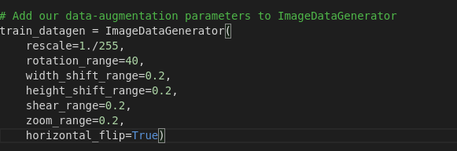
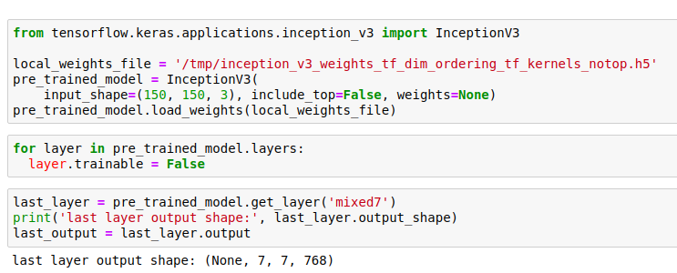
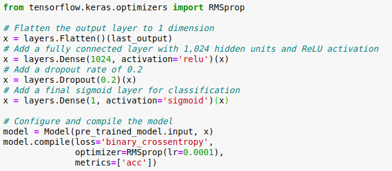

 
# MODAK_CLASSIFIER

Determines if an image is modak or not used a CNN network with Transfer Learning,Accurracy is 86.21 percent on Training and 73.78 percent on validation After 10 epochs.

## Step.1 Data Collection

We Need to Scrape Google Images to Get the dataset.I scrapped for images of MODAK to be classified as label 0 and rasgulla,momo,Gulabjamun and laddu to classify as label 0

To download food images from Google_iamges we can use

google_images_download
(Python Script for ‘searching’ and ‘downloading’ hundreds of Google images to the local hard disk!)

To get this python package user needs to run- pip_install_google_images_download in Command terminal

### Organising Dataset in a folder
We need to make two directories train_directory and Validation_directory , both of them have train data and test data
The Dataset of around 2000 images is in provided in the repository 

## Step.2 Data Augemtation
As we know CNN models are always Data Hungry 1746 train images and 330 test images are not enough to train our model properly, so we need to implement Data Augmentation to increase size of Dataset via ImageDataGenerator Library from Keras.

 I did a rescaling,rotation by a range of 40 in both clockwise and anticlockwise Direction,width_shift_range and height_shift_range of 0.2,shear_range of 0.2,zoom_range of 0.2 and horizontal flipping being True,I didnt take Vertical flipping into account as it may not look like a modak after it .
 
## Step.3 Choosing and Fitting our Model
In all the Below Step i have Used a google colab notebook,We need to upload our data to google Drive and Mount our Notebook to the Drive All steps are performed in Colab notebook in the Repository.

I used Transfer learning to Import a Inception_v3 Network Pretrained Network for this task, This would save me large computing power,Transfer Learning and Mostly used for Computer extensive task like CNN.

Remove the Top layer from the Network,and redefine it for our own input Data And then compile the model With a Sigmoid Unit in the Output for Binary Classification Output 1 is Defined as a Modak and Output 0 is defined as NotModak.

Now lets fit the model using model.fit_generator for 10epochs with real time image augmentation.

## Step.4 Validation and Accuracy 
Now lets cheak accuracy,Validation accuracy ,Loss and validation loss using model history we have saved previously 

Plots for the same 

## Vedrict
### Achieved a accurracy of 86.21 percent on Training and 73.78 percent on validation After 10 epoch But loss is Also high Possibly Due to Dataset being small in size.
Feel free to contribute on how to Improve the Model.
