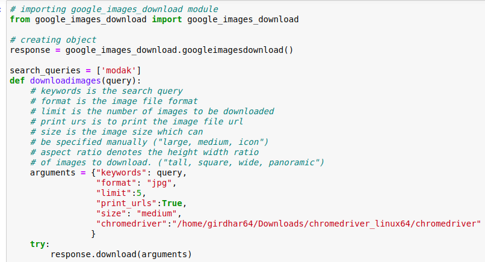
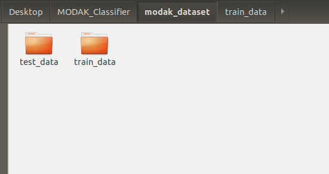

# MODAK_Classifier
Determines if an image is modak or not.
STEP.1 Collected Dataset by scrapping Google images
STEP.2 Data Augmentation to increase size of Dataset via ImageDataGenerator Library from Keras
STEP.3 Trained the model on 1700 Images, Accurracy is 86.21 percent on Training and 73.78 percent on validation After 10 epochs 
# MODAK_CLASSIFIER

Determines if an image is modak or not used a CNN network with Transfer Learning,Accurracy is 86.21 percent on Training and 73.78 percent on validation After 10 epochs.

## Step.1 Data Collection

We Need to Scrape Google Images to Get the dataset.I scrapped for images of MODAK to be classified as label 0 and rasgulla,momo,Gulabjamun and laddu to classify as label 0

To download food images from Google_iamges we can use

google_images_download
(Python Script for ‘searching’ and ‘downloading’ hundreds of Google images to the local hard disk!)

To get this python package user needs to run- pip_install_google_images_download in Command terminal

### Organising Dataset in a folder
We need to make two directories train_directory and Validation_directory , both of them have train data and test data
The Dataset of around 2000 images is in provided in the repository 

